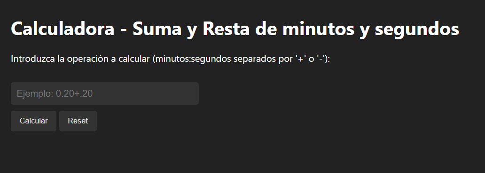
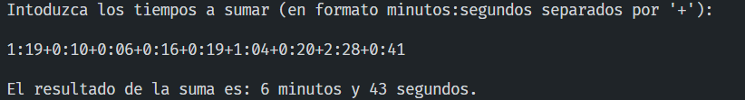
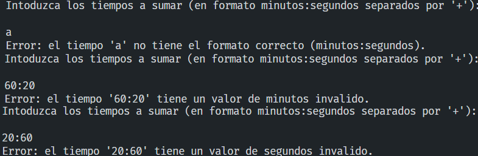

# Calculadora. Suma y Resta de minutos y segundos.
 
- José Javier Díaz González
- Año 2023

| Acceso al enlace:|
| --- |
| [Página de despliegue](https://alu0101128894.github.io/Calculadora-suma-minutos-segundos/) |

### La salida en página Web:
 

## Introducción
Aquí mostramos una *función que calcula una suma de minutos y segundos* seguidos por '+'

1. Para compilar el programa, se necesitará una versión **Linux** y el lenguaje de **Python3** instalado. 

2. Para instalar el lenguaje, se deberá escribir
   > sudo apt install python3.8

3. Para ejecutar el programa escribimos en la terminal:
    > python3 [calculadora_suma.py](calculadora_suma.py)

## Programa (Python):

#### La salida del programa:

 

#### Con manejo de exepciones, se verían tal que así:

 